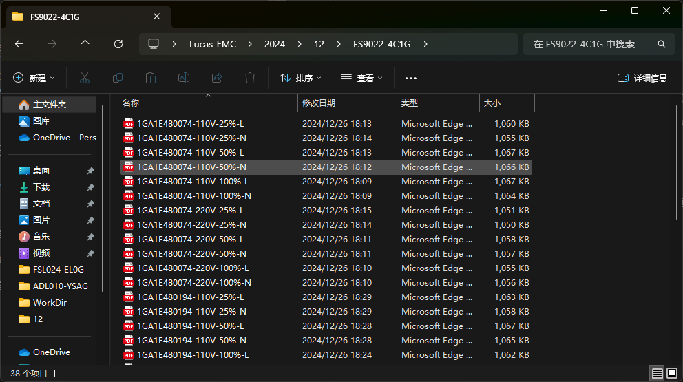
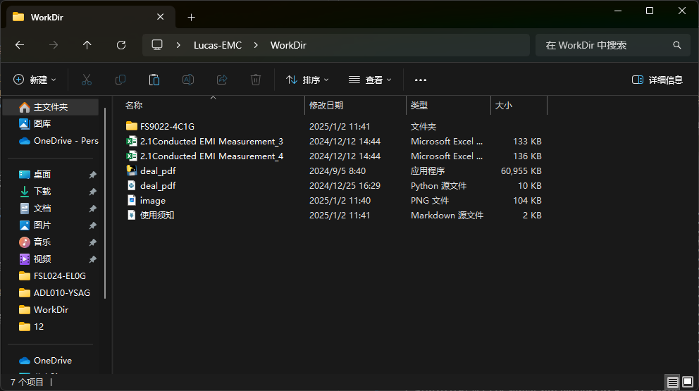

# EMI pdf报告转excel报告程序使用须知

## 一、如何使用

### 1.1 使用前提

- 软件版本: `ELEKTRA 4.52.1`。
- 报告导出选择pdf格式，并按照 `序列号-输入电压-负载-线性.pdf` 的方式命名。

### 1.2 开始使用

> 1. 将同一机种且遵照上述命名方式的EMI pdf报告放入该机种名称命名的文件夹内，如下图所示。
> 
> 2. 将这个文件夹复制到deal_pdf.exe的路径下，反之亦可，见下图。
> 
> 3. 双击deal_pdf.exe，程序将自动扫描文件夹内的pdf文件，并生成excel报告。
> 4. 程序生成的excel报告默认保存在与deal_pdf.exe同级的目录。

## 二、注意事项

- 程序会自动识别pdf文件中的电压、负载、线性等信息，根据这些信息将数据写入excel报告中。
